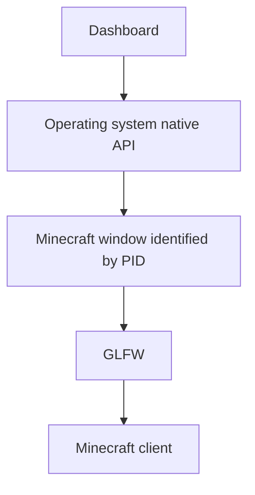
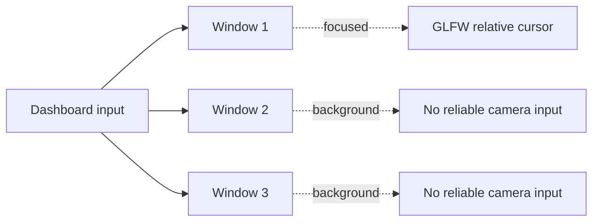
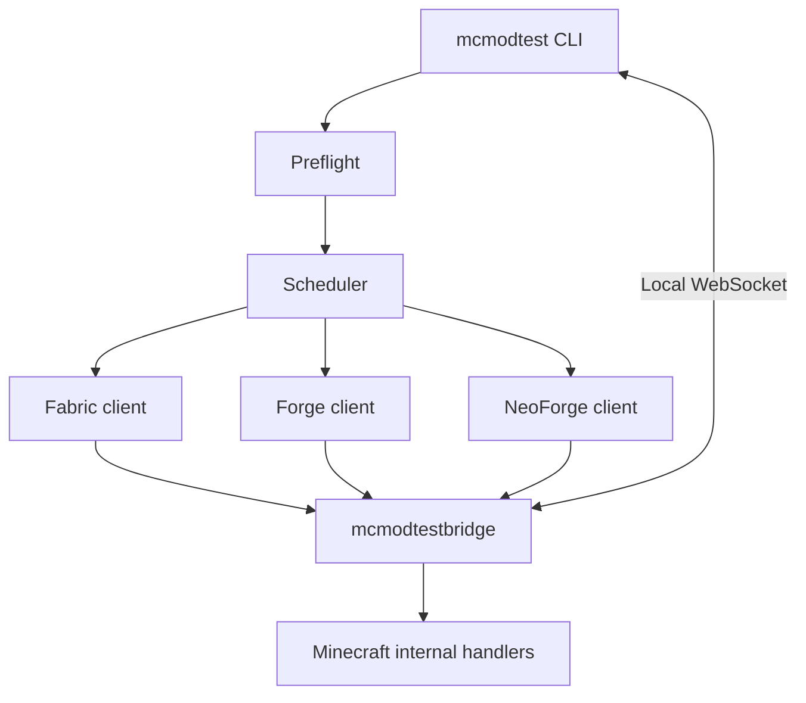
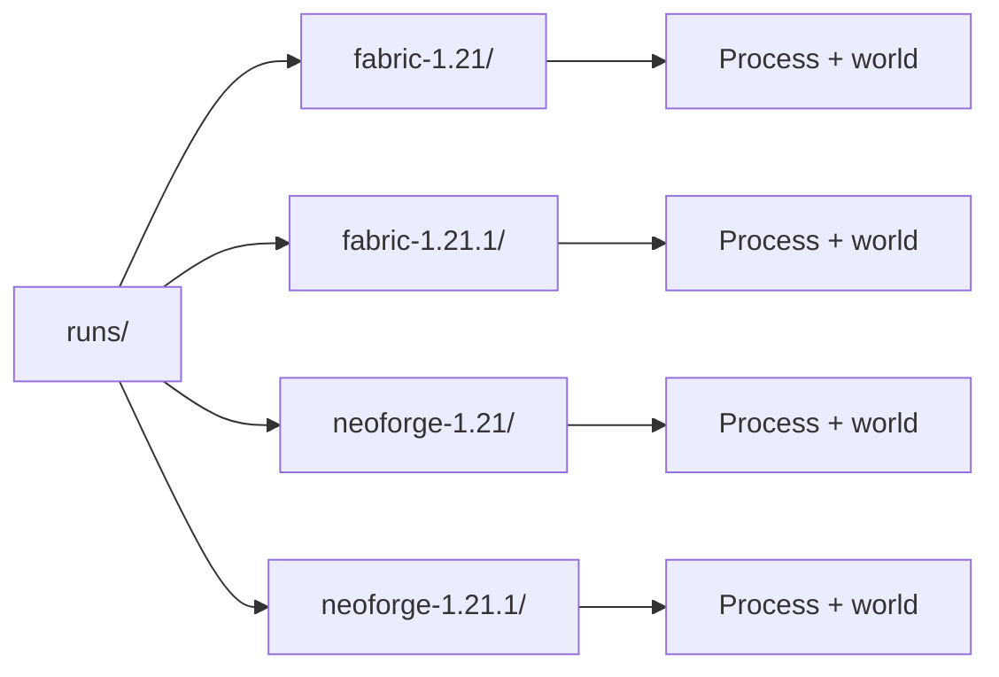
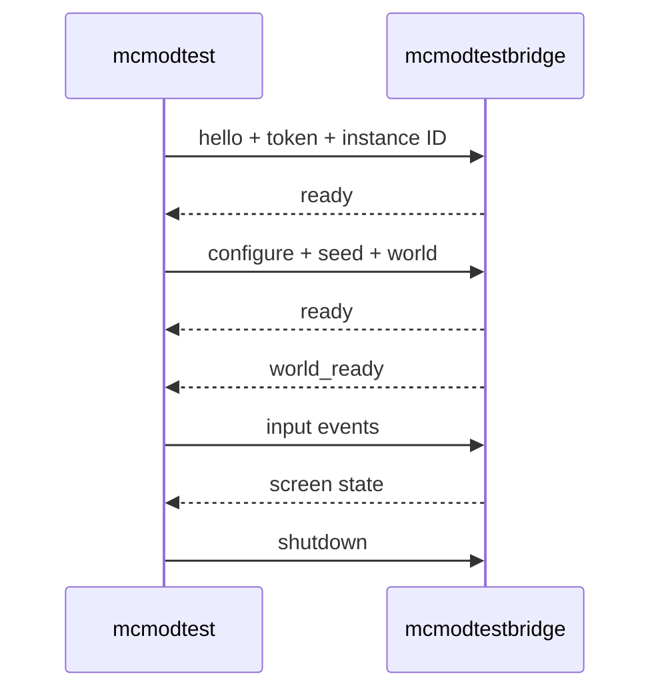
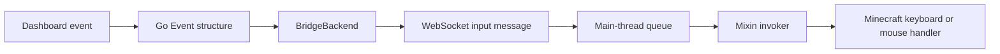
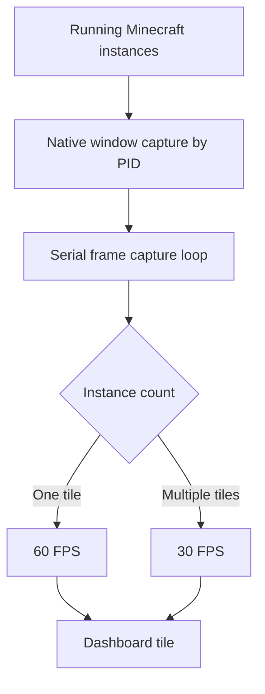
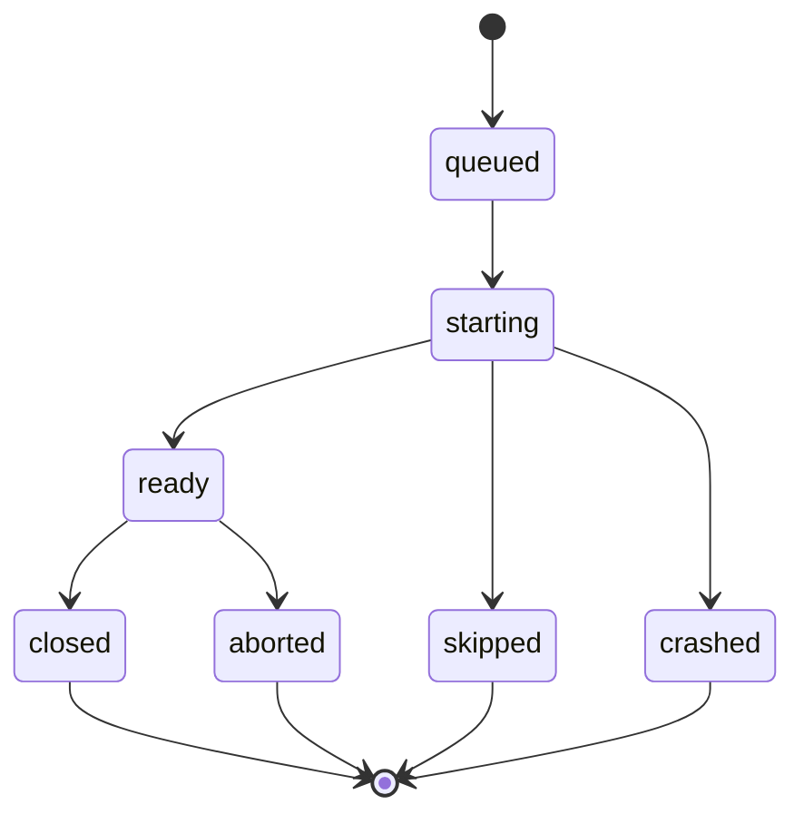



## Introduction

When developing a Minecraft mod, testing a single version and loader combination is relatively straightforward. The problem arises when the same mod works across multiple versions—as well as on Fabric, Forge, or NeoForge—but how do we know? By testing each version to see if it crashes.

The manual process has to be repeated many times:

1. Prepare a Minecraft instance.
2. Install the correct loader.
3. Download dependencies.
4. Copy the mod JAR.
5. Open a world.
6. Test it manually.
7. Review the logs.
8. Repeat everything for the next version.

To avoid this process, I built two related projects:

- **mcmodtest**: an orchestrator written in Go.
- **mcmodtestbridge**: a client-only mod written in Java.

`mcmodtest` handles processes, files, downloads, and reports. `mcmodtestbridge` handles the inside of the Minecraft client: worlds, keyboard, mouse, and UI state.

## The Original Goal

I wanted to test a mod across multiple versions simultaneously using a single command:

```bash
./mcmodtest run \
  --project /home/user/GoFishRehooked \
  --loaders fabric,neoforge \
  --versions "26.1,26.1.1,26.1.2,26.2" \
  --max-instances 2
```

Each loader and version combination becomes an independent instance:

```text
fabric/26.1
fabric/26.1.1
fabric/26.1.2
fabric/26.2
neoforge/26.1
neoforge/26.1.1
neoforge/26.1.2
neoforge/26.2
```

The tool shares one seed across the entire run, creates a new world for each instance, limits the number of simultaneous clients, and generates a final report.

## The First Attempt: Doing It Without a Bridge

The first idea was to avoid adding another mod to Minecraft. The plan was to start regular clients and control them from `mcmodtest` using each operating system's native APIs.

The sequence was:



CoreGraphics was explored on macOS, Win32 on Windows, and X11 on Linux. This strategy had one clear advantage: the client did not have to be modified, and no additional artifact had to be distributed.

### What Worked

The initial approach made it possible to:

- detect Minecraft processes;
- capture their windows;
- display the images in a dashboard;
- move a virtual cursor;
- send some keyboard events;
- control an instance that had focus.

That made it initially seem as though the problem was finding the correct window or adjusting the coordinates.

### The Real Problem: GLFW and Focus

The difficulty appeared when trying to control several instances at the same time.



The dashboard received movement and the virtual cursor moved, but Minecraft did not always move the camera or respond to clicks. On macOS, GLFW's relative cursor mode depends on the window having focus. In addition, the system can have only one active window.

Sending an event to a PID was not enough to make several GLFW windows behave as if they were focused simultaneously.

The result could be summarized as follows:

```text
The dashboard received movement                   ✓
The virtual cursor moved                          ✓
Minecraft received reliable camera input          ✗
Minecraft received reliable clicks                ✗
```

The native call could post synthetic events, but it could not force every Minecraft window into the relative camera mode expected by GLFW.

### Coordinates, Recentering, and Clicks

Several secondary problems also appeared:

- the visual cursor did not match the real cursor;
- the title bar changed the calculated center of the window;
- the dashboard and Minecraft used different scales;
- the vertical axis could be inverted or offset;
- clicks were initially sent to the center of the window;
- recentering could cause jumps;
- fast movements caused desynchronization.

PID-specific offsets, movement accumulation, pointer recentering, and conversions between the window area and the content area were added. These fixes improved the experience, but they were still working around the same limitation: GLFW needed a focused window.

### The Modifier Key Problem

Even if the dashboard sent a `Shift` event, Minecraft could query GLFW's native state directly through `InputConstants.isKeyDown`. From GLFW's point of view, the key was not pressed because the Minecraft window remained in the background.

That is why combinations such as `Shift + click` or `F3 + F4` could fail even though the virtual event had been sent.

### The Problem of Knowing When Minecraft Was Ready

Detecting that the Java process had started did not mean that Minecraft was ready either.

It was necessary to distinguish between:

```text
Process created
Window created
Client loaded
World opened
Client ready to receive input
```

Without an internal signal, the orchestrator could only make approximations based on timing, logs, or the existence of the window.

## The Harness Alternative

During the design, I also considered using a harness or auxiliary mod to handle startup state, world creation, and input.

The problem was that this harness added another layer to the system:

- another JAR to distribute;
- more logic inside the test environment;
- another communication protocol;
- manifest and versioning problems;
- more components that could alter the environment I actually wanted to test.

I decided to remove that idea and replace it with a small, purpose-built bridge.

The difference is that the bridge contains no logic from the mod under test. It only connects the external controller to the Minecraft client.

## The Final Architecture

The flow changed from this:

```text
Dashboard → Native API → GLFW → Minecraft
```

to this:

```text
Dashboard → Local WebSocket → ClientBridge → Minecraft internal handlers
```

Visual capture remained outside the client, but input and world state began to be managed from inside Minecraft.




*The bridge loaded in the Minecraft mod list across multiple test instances.*

## How `mcmodtest` Works

### Matrix Expansion

The CLI accepts a list of loaders and a shared list of versions. The matrix is expanded in `internal/preflight/preflight.go`:

```go
for _, loader := range uniqueLoaders(loaders) {
	for _, gameVersion := range unique(versions) {
		bridgeID, err := BridgeArtifactID(loader, gameVersion)
		if err != nil {
			skipped = append(
				skipped,
				skippedResult(
					loader,
					gameVersion,
					"bridge unavailable: "+err.Error(),
					0,
				),
			)
			continue
		}

		targets = append(targets, matrixTarget{
			Loader:    loader,
			Minecraft: gameVersion,
			BridgeID:  bridgeID,
		})
	}
}
```

Combinations without a compatible bridge are marked as `skipped`. A configuration, download, or dependency error, on the other hand, remains fatal because it represents a real execution problem.

### JAR Resolution

For a single JAR, `--mod` can be used:

```bash
./mcmodtest run \
  --mod build/libs/mod.jar \
  --loaders fabric \
  --versions 1.21
```

For a multiloader project, `--project` is used. The tool looks for each artifact in:

```text
<project>/<loader>/build/libs
```

It ignores `sources` and `javadoc` files and selects the most recent regular JAR. This prevents the Fabric JAR from accidentally being used to start a NeoForge instance.

### Downloads and Isolation

Preflight resolves and caches the Minecraft client, its libraries, assets, loader, mod dependencies, and bridge.

Each combination receives its own root:

```text
runs/
├── fabric-1.21/
├── fabric-1.21.1/
├── neoforge-1.21/
└── neoforge-1.21.1/
```

The seed is shared, but the directories, processes, and worlds remain isolated.




*Each loader and version combination receives its own isolated run directory.*

## The Local WebSocket Server

For each run, `mcmodtest` creates a WebSocket server on localhost and generates a random token:

```go
tokenBytes := make([]byte, 32)
if _, err := rand.Read(tokenBytes); err != nil {
	return nil, fmt.Errorf("generate bridge token: %w", err)
}

listener, err := net.Listen("tcp", "127.0.0.1:0")
if err != nil {
	return nil, fmt.Errorf("listen for bridge: %w", err)
}

s := &Server{
	URL: "ws://127.0.0.1:" +
		strconv.Itoa(listener.Addr().(*net.TCPAddr).Port) +
		"/bridge",
	Token: base64.RawURLEncoding.EncodeToString(tokenBytes),
}
```

The port is assigned automatically. The server also knows the valid instance IDs in advance and rejects unexpected or duplicate connections.

## The Handshake

The protocol uses small, explicit messages:

| Direction | Message | Function |
|---|---|---|
| Bridge → Go | `hello` | Authenticate and announce the instance |
| Go → Bridge | `configure` | Send the seed and world name |
| Bridge → Go | `ready` | Confirm the configuration |
| Bridge → Go | `world_ready` | Confirm that the world was opened |
| Go → Bridge | `input` | Send keyboard and mouse input |
| Go → Bridge | `shutdown` | Request shutdown |
| Bridge → Go | `screen` | Report whether it is in a world or menu |



The server waits for `ready` and `world_ready` before considering an instance ready:

```go
if err := client.send(Message{
	Type:       "configure",
	Protocol:   Protocol,
	InstanceID: instanceID,
	Seed:       seed,
	World:      world,
}); err != nil {
	return nil, err
}

if err := client.wait(ctx, func(message Message) error {
	if message.Type != "ready" {
		return unexpectedMessage(message)
	}
	return validateStatus(message, instanceID)
}); err != nil {
	return nil, err
}
```

The Minecraft process receives the configuration through environment variables:

```go
environment = append(environment,
	"MCMODTEST_BRIDGE_URL="+spec.Bridge.URL,
	"MCMODTEST_BRIDGE_TOKEN="+spec.Bridge.Token,
	"MCMODTEST_INSTANCE_ID="+spec.BridgeInstanceID,
)
```

There is no need to write the port or token to permanent configuration files.

## How `mcmodtestbridge` Works

The bridge uses a common module and loader-specific entrypoints for Fabric, Forge, and NeoForge.

The Fabric entrypoint is small:

```java
public final class FabricMod implements ClientModInitializer {
    @Override
    public void onInitializeClient() {
        CommonMod.init();
        ClientBridge.start();
    }
}
```

Forge and NeoForge call the same `ClientBridge.start()` from their own entrypoints.

The bridge reads the environment variables and validates that the connection is local:

```java
String rawUrl = System.getenv("MCMODTEST_BRIDGE_URL");
String token = System.getenv("MCMODTEST_BRIDGE_TOKEN");
instanceId = System.getenv("MCMODTEST_INSTANCE_ID");

if (isBlank(rawUrl) || isBlank(token) || isBlank(instanceId)) {
    LOGGER.info("{} disabled: bridge environment is not configured",
            Constants.MOD_NAME);
    return;
}

URI uri = URI.create(rawUrl);

if (!"ws".equalsIgnoreCase(uri.getScheme())
        || !"127.0.0.1".equals(uri.getHost())) {
    throw new IllegalArgumentException(
            "bridge URL must use ws://127.0.0.1");
}

connect(uri, token);
```

When it connects, it sends `hello` with the protocol, token, and instance ID.

## Creating a World from the Client

After receiving `configure`, the bridge creates a new world using the vanilla sequence:

```java
LevelSettings settings = new LevelSettings(
        worldName,
        GameType.CREATIVE,
        false,
        Difficulty.NORMAL,
        true,
        gameRules,
        WorldDataConfiguration.DEFAULT
);

WorldOptions options = new WorldOptions(seed, true, false);

minecraft.createWorldOpenFlows().createFreshLevel(
        worldName,
        settings,
        options,
        NORMAL_WORLD_DIMENSIONS,
        (Screen) null
);
```

When Minecraft actually opens the world, the bridge sends `world_ready`. This is more reliable than assuming that the client is ready just because the process exists.

## The Minecraft Main Thread

WebSocket callbacks execute outside the game's main thread. That is why the bridge does not apply events received from the network directly.

It adds them to a queue:

```java
case "input" -> {
    JsonObject event = requiredObject(message, "event");
    MAIN_QUEUE.add(() -> applyInput(event));
}
```

A Mixin calls `ClientBridge.tick()` from Minecraft's `tick`:

```java
@Inject(method = "tick", at = @At("TAIL"))
private void mcmodtestbridge$tick(CallbackInfo callbackInfo) {
    ClientBridge.tick((Minecraft) (Object) this);
}
```

The queue is processed during that cycle:

```java
Runnable task;

while ((task = MAIN_QUEUE.poll()) != null) {
    try {
        task.run();
    } catch (RuntimeException error) {
        fail("main-thread bridge task failed", error);
    }
}
```

This decision prevents client state from being modified from the wrong thread.

## Keyboard and Mouse

In Go, the dashboard transforms events into a common structure:

```go
type Event struct {
	Kind      EventKind `json:"kind"`
	KeyCode   int       `json:"keyCode,omitempty"`
	ScanCode  int       `json:"scanCode,omitempty"`
	Button    int       `json:"button,omitempty"`
	Down      bool      `json:"down,omitempty"`
	DX        int       `json:"dx,omitempty"`
	DY        int       `json:"dy,omitempty"`
	WheelX    int       `json:"wheelX,omitempty"`
	WheelY    int       `json:"wheelY,omitempty"`
	Modifiers uint32    `json:"modifiers,omitempty"`
}
```

`BridgeBackend` looks up the bridge corresponding to each instance and sends the event:

```go
for _, target := range targets {
	b.mu.RLock()
	sender := b.senders[target.ID]
	b.mu.RUnlock()

	if sender == nil {
		failures = append(failures, TargetError{
			ID:  target.ID,
			PID: target.PID,
			Err: errors.New("bridge instance is not connected"),
		})
		continue
	}

	if err := sender.SendInput(event); err != nil {
		failures = append(failures, TargetError{
			ID:  target.ID,
			PID: target.PID,
			Err: fmt.Errorf("send input: %w", err),
		})
	}
}
```

In Java, the event is transformed into a call to the corresponding internal handler:

```java
switch (kind) {
    case 0, 1 -> applyKey(minecraft, event, window, modifiers, kind == 0);
    case 2 -> applyMouseMove(minecraft, event, window);
    case 3 -> applyMouseButton(minecraft, event, window, modifiers);
    case 4 -> applyMouseWheel(minecraft, event, window);
    case 5 -> applyText(minecraft, event, window, modifiers);
    default -> fail("unsupported input event kind " + kind, null);
}
```



The bridge uses Mixin invokers to call Minecraft's internal keyboard and mouse methods without depending on a focused window.

## Virtual Key State

To make Minecraft recognize modifier keys, I added a Mixin to `InputConstants.isKeyDown`:

```java
@Inject(
        method = "isKeyDown",
        at = @At("HEAD"),
        cancellable = true
)
private static void mcmodtestbridge$isKeyDown(
        Window window,
        int keyCode,
        CallbackInfoReturnable<Boolean> callbackInfo
) {
    if (ClientBridge.isVirtualKeyDown(keyCode)) {
        callbackInfo.setReturnValue(true);
    }
}
```

The bridge maintains its own state for pressed keys and buttons. It also releases those states when input is paused, the connection is lost, or an instance is closed. This prevents keys from getting "stuck."

## The Dashboard and Visual Capture

Visual capture remained in `mcmodtest`. Each instance appears in a tile, and the window is captured by PID through the operating system's native backend.

```go
func (d *Dashboard) captureLoop(ctx context.Context) {
	timer := time.NewTimer(d.captureInterval())
	defer timer.Stop()

	for {
		select {
		case <-ctx.Done():
			return
		case <-d.done:
			return
		case <-timer.C:
			d.captureFrames()
			timer.Reset(d.captureInterval())
		}
	}
}
```

This part produced another interesting problem: with a single instance, the tile occupies almost the entire dashboard and each frame has to copy a large RGBA texture. Minecraft could look smooth when focused, while the preview appeared laggy.

Capture remained serial, and its frequency was adjusted according to the number of instances. The current code uses 60 FPS for a single tile and 30 FPS when there are zero or multiple instances, preventing delayed frames from accumulating.




*The dashboard displays several Minecraft clients and their current status simultaneously.*

## Reproducibility and Reports

Each instance is identified by `loader/version`. This identity is used to route events to the correct client, record the PID, update the corresponding tile, report errors, and distinguish instances in the scheduler.

The main states are:

```text
queued → starting → ready → closed
                         └→ crashed
                         └→ aborted

skipped  // incompatible combination
```

The final report distinguishes a skipped combination from a run that actually failed.



## Security and Limitations

The bridge is designed for local communication:

- the server listens only on `127.0.0.1`;
- each run uses a random token;
- the protocol and instance ID are validated;
- messages have a maximum size;
- private Maven credentials are not passed to Minecraft.

There are some intentional limitations:

- Linux requires an X11 session for capture;
- Unicode and IME are not implemented;
- the bridge must be compiled for the compatible Minecraft family;
- capture depends on each operating system's native APIs;
- the bridge is distributed from a private Maven repository.

## Conclusion

The project did not start with a perfect architecture. I first tried to control Minecraft from outside using the operating system's native APIs. That approach made it possible to validate capture and the dashboard, but it revealed that focus, GLFW, and the client's internal state could not be controlled reliably from outside.

The problems with coordinates, recentering, and modifiers helped identify the root cause. The decisive realization was that an external application could send events, but it could not turn several GLFW windows into simultaneously focused clients.

That is why the bridge ultimately became necessary.

The final architecture maintains a clear boundary:

- `mcmodtest` coordinates the outside world: processes, files, versions, dependencies, the dashboard, and reports.
- `mcmodtestbridge` coordinates the inside world: Minecraft, worlds, input, and client state.

The result is a local laboratory for testing mods repeatably and comparing versions without manually preparing each instance.

The main lesson was that the external orchestrator and the Minecraft client should not try to do each other's work. A small, explicit WebSocket protocol was enough to connect them.

